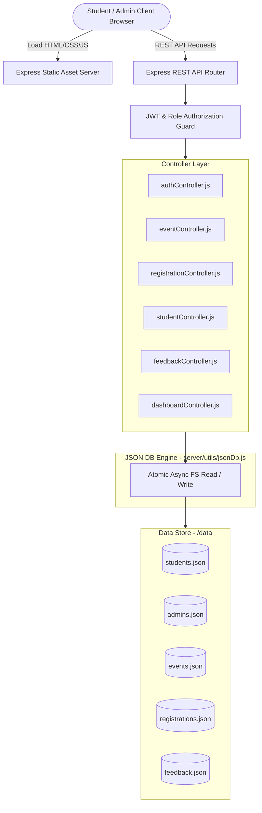

# 🎓 TAE-I PROJECT DOCUMENTATION REPORT

---

## 1. Title Page

**Project Title:**  
CampusConnect – Smart College Event Management and Student Engagement System  

**Academic Evaluation:**  
Term Assessment Examination - I (TAE-I)  
Department of Computer Science & Engineering / Information Technology  
Apex Institute of Engineering & Technology  

**Academic Year:**  
2025 – 2026  

---

## 2. Certificate

This is to certify that the project entitled **"CampusConnect – Smart College Event Management and Student Engagement System"** is a bona fide work carried out by the student team in partial fulfillment of the requirements for the degree of **Bachelor of Technology (B.Tech)** in Computer Science & Engineering during the academic year 2025–2026.

**Internal Guide / Project Supervisor**  
Department of Computer Science & Engineering  

**Head of Department (HOD)**  
Department of Computer Science & Engineering  

---

## 3. Declaration

We hereby declare that the project entitled **"CampusConnect – Smart College Event Management and Student Engagement System"** submitted to Apex Institute of Engineering & Technology is an authentic record of our own work carried out under the guidance of the faculty supervisor. The matter embodied in this report has not been submitted for the award of any other degree or diploma.

---

## 4. Acknowledgement

We express our sincere gratitude to our Project Guide, the Head of the Department, and the Dean of Student Affairs for providing invaluable guidance, facilities, and encouragement throughout the design and development of CampusConnect. We also thank our peers for their feedback during user acceptance testing.

---

## 5. Abstract

Campus activities, technical symposiums, hackathons, and cultural fests play a crucial role in student engagement and holistic professional development. However, traditional event management in academic institutions relies on fragmented notice boards, Google Forms, and social media channels. These methods suffer from missing registration records, lack of real-time seat capacity tracking, untracked attendance, and high manual administration costs.

**CampusConnect** is a full-stack web application designed to digitize, unify, and streamline the college event lifecycle. Built with a Node.js and Express.js REST API backend, a custom atomic JSON Database engine, and a responsive HTML5/Bootstrap 5 frontend, CampusConnect provides role-based access for Students and Administrators. Students can discover events, filter by category/department, register with 1-click, download digital passes with unique ticket numbers, and submit reviews. Administrators can manage the complete event lifecycle, track capacity utilization, manage student enrollments, and analyze participation metrics using Chart.js visualizations.

---

## 6. Introduction

Colleges and universities host dozens of events each academic semester—ranging from 36-hour hackathons and technical paper presentations to inter-college sports tournaments and cultural festivals. To ensure maximum student participation and smooth logistical execution, an institutional management system is required.

CampusConnect provides an automated, centralized web platform where all stakeholders—students, faculty organizers, and institutional deans—collaborate effectively without relying on third-party spreadsheets or manual verification desks.

---

## 7. Problem Statement

1. **Information Fragmentation:** Event notices distributed via disparate WhatsApp groups or paper circulars are frequently missed by interested students.
2. **Spreadsheet Bottlenecks:** Using ad-hoc Google Forms often leads to duplicate registrations, unvalidated student IDs, and lacks automated waitlisting when event venues reach full capacity.
3. **No Central Ticket Verification:** Without unique digital passes, event entry gates face congestion and unauthorized attendance.
4. **Lack of Institutional Analytics:** College administration lacks consolidated visibility into departmental engagement rates, popular categories, and student feedback.

---

## 8. Existing System

| Parameter | Existing System (Manual / Google Forms) |
| :--- | :--- |
| **Notification** | Notice boards, physical posters, classroom announcements |
| **Registration** | Separate Google Forms for every single club / event |
| **Pass Generation** | Manual email confirmations or physical tokens |
| **Capacity Control** | Manual form closure after capacity is breached |
| **Data Storage** | Disconnected spreadsheets across different student clubs |
| **Analytics** | Manual tallying of responses |

---

## 9. Proposed System (CampusConnect)

CampusConnect introduces an integrated, single-tenant web ecosystem:
- **Centralized Event Portal:** Single source of truth for all campus activities with search and multi-parameter filtering.
- **1-Click Digital Registration:** Instant pass generation with unique alphanumeric ticket identifiers (`TCK-EVTxxx-xxxx`).
- **Real-Time Capacity Tracker:** Atomic seat counter that automatically handles waitlisting when maximum capacity is reached.
- **Role-Based Portals:** Specialized Student and Administrator portals with secure JWT authentication.
- **Dynamic Analytics Dashboard:** Visual metrics for event categories, attendance status, and venue utilization.

---

## 10. Objectives

1. Create a modern, responsive web application for college event management.
2. Implement robust REST APIs using Node.js and Express.js.
3. Construct a safe, atomic, file-based JSON database engine meeting TAE-I academic guidelines.
4. Provide seamless 1-click event registration, pass generation, cancellation, and feedback submission.
5. Provide administrative controls for event CRUD, seat capacity limits, attendee status updates, and visual data analytics.

---

## 11. Scope

- **Institutional Level:** Applicable across all academic departments (CSE, IT, ECE, ME, Civil, Sports, Management).
- **Stakeholders:** Undergraduate/Postgraduate students, student club coordinators, faculty event convenors, and Dean of Student Affairs.
- **Deployment:** Zero external database server requirement; ready for immediate deployment on cloud platforms such as Render.

---

## 12. Functional Requirements

### Student Module
- Register new student account with validation.
- Authenticate and maintain JWT session.
- Search events by name, organizer, or venue.
- Filter events by Category, Department, Status, or Date.
- Register for available events and generate a printable digital pass.
- Cancel registrations and release venue capacity.
- Submit ratings (1–5 stars) and review comments for attended events.
- Update personal profile and change security credentials.

### Administrator Module
- Secure administrator authentication.
- Create new events with venue, dates, time, seat capacity, eligibility, and rules.
- Edit and update event parameters and status.
- Delete events and automatically clean up associated registrations and feedback.
- Manage student directory and view department affiliations.
- Monitor registrations and modify statuses (`Registered`, `Attended`, `Cancelled`, `Waitlisted`).
- Access analytics charts (Events by Category, Registration Status, Capacity Utilization).
- Moderate and delete inappropriate student feedback.

---

## 13. Non-Functional Requirements

- **Performance:** Response times under 100ms for database read/write queries.
- **Reliability:** Atomic file write protocol using temporary files (`.tmp`) and file renaming prevents data corruption.
- **Security:** Password hashing with `bcryptjs` (salt rounds: 10) and JWT token validation.
- **Usability:** Mobile-first, responsive interface built with Bootstrap 5.3 and intuitive typography.
- **Maintainability:** Modular MVC architecture separating routes, controllers, middleware, and database utilities.

---

## 14. Technology Stack

- **Frontend:** HTML5, CSS3, Bootstrap 5.3, Bootstrap Icons, Chart.js, Vanilla ES6+ JavaScript.
- **Backend:** Node.js (v18+), Express.js (v4.19+), CORS, Morgan.
- **Database:** JSON File Database Engine (`data/students.json`, `data/admins.json`, `data/events.json`, `data/registrations.json`, `data/feedback.json`).
- **Security:** `jsonwebtoken` (JWT), `bcryptjs`.
- **Deployment:** Render Cloud Platform (`render.yaml`).

---

## 15. System Architecture



---

## 16. Module Description

1. **Authentication & Authorization Module:** Manages registration, password hashing, JWT creation, token decoding, and role-based route guards (`requireAdmin`, `requireStudent`).
2. **Event Management Module:** Handles full CRUD operations, multi-parameter filtering, full-text search, and capacity validation.
3. **Registration & Pass Generation Module:** Validates student registration eligibility, prevents duplicate submissions, atomically increments seat counters, and assigns unique ticket pass IDs.
4. **Feedback & Review Module:** Enables attendees to provide star ratings and qualitative reviews; computes average ratings per event.
5. **Dashboard & Analytics Module:** Aggregates real-time statistics, calculates department/status distribution, and supplies data for Chart.js graphics.

---

## 17. Database Design

The database uses five normalized JSON collections:
1. `students.json` – Student demographics, academic records, and hashed credentials.
2. `admins.json` – Administrator accounts with privilege flags.
3. `events.json` – Event catalog, logistics, seat limits, and current registration counters.
4. `registrations.json` – Event passes linking student IDs with event IDs and ticket codes.
5. `feedback.json` – Student reviews and ratings linked to event records.

---

## 18. JSON Database Structure

### Schema: `students.json`
```json
{
  "id": "STU001",
  "studentId": "2022CS0145",
  "fullName": "Aarav Sharma",
  "email": "aarav.sharma@campusconnect.edu",
  "mobileNumber": "9876543210",
  "department": "Computer Science & Engineering",
  "course": "B.Tech",
  "year": "3rd Year",
  "password": "<bcrypt_hash>",
  "role": "student",
  "bio": "Enthusiastic developer",
  "createdAt": "2026-01-10T10:00:00.000Z",
  "updatedAt": "2026-01-10T10:00:00.000Z"
}
```

### Schema: `events.json`
```json
{
  "id": "EVT001",
  "eventName": "TechFest 2026 – Annual Technology Symposium",
  "description": "Flagship national level technical symposium...",
  "category": "Fest",
  "department": "All Departments",
  "organizer": "Technical Affairs Council",
  "date": "2026-09-15",
  "startTime": "09:00 AM",
  "endTime": "06:00 PM",
  "venue": "Main Auditorium & Tech Quad",
  "maxCapacity": 300,
  "currentRegistrations": 3,
  "registrationDeadline": "2026-09-10",
  "eventStatus": "Registration Open",
  "eventImage": "https://images.unsplash.com/...",
  "eligibility": "All Engineering & Science students.",
  "rules": "1. College ID mandatory.\n2. Be on time.",
  "createdAt": "2026-01-05T10:00:00.000Z"
}
```

### Schema: `registrations.json`
```json
{
  "id": "REG001",
  "studentId": "STU001",
  "studentName": "Aarav Sharma",
  "studentRoll": "2022CS0145",
  "studentEmail": "aarav.sharma@campusconnect.edu",
  "studentDepartment": "Computer Science & Engineering",
  "eventId": "EVT001",
  "eventName": "TechFest 2026 – Annual Technology Symposium",
  "eventDate": "2026-09-15",
  "venue": "Main Auditorium & Tech Quad",
  "registrationDate": "2026-02-01T10:15:00.000Z",
  "status": "Registered",
  "ticketNumber": "TCK-EVT001-9841",
  "notes": "Participating in Bot Combat"
}
```

---

## 19. API Design

| Method | Endpoint | Access | Description |
| :--- | :--- | :--- | :--- |
| `POST` | `/api/auth/student/register` | Public | Student signup |
| `POST` | `/api/auth/student/login` | Public | Student login |
| `POST` | `/api/auth/admin/login` | Public | Administrator login |
| `GET` | `/api/auth/me` | Authenticated | Fetch active user profile |
| `GET` | `/api/events` | Public | List & filter events |
| `GET` | `/api/events/:id` | Public | Detailed event info |
| `POST` | `/api/events` | Admin | Create new event |
| `PUT` | `/api/events/:id` | Admin | Update event details |
| `DELETE` | `/api/events/:id` | Admin | Delete event |
| `GET` | `/api/registrations` | Admin | List all registrations |
| `GET` | `/api/registrations/student/:id`| Self/Admin | Student event passes |
| `POST` | `/api/registrations` | Student | 1-Click register |
| `PUT` | `/api/registrations/:id` | Self/Admin | Cancel/Update pass status |
| `GET` | `/api/dashboard/admin` | Admin | Admin metrics & charts |
| `GET` | `/api/dashboard/student/:id` | Self/Admin | Student dashboard counters |

---

## 20. UI/UX Design

- **Design System:** Built using Bootstrap 5.3 with custom CSS tokens for deep indigo (`#4f46e5`), radiant cyan (`#0ea5e9`), clean white surfaces, and smooth typography (`Plus Jakarta Sans`).
- **Responsive Layout:** Complete support for Mobile (<576px), Tablet (768px–991px), and Desktop (>992px) screens.
- **Component Polish:** Glassmorphism headers, subtle card hover elevations, toast notifications for instant feedback, and dedicated printable pass templates.

---

## 21. Implementation

- **Controller Pattern:** Business logic is decoupled from route declarations inside `server/controllers/`.
- **Atomic File Operations:** `server/utils/jsonDb.js` writes JSON strings to `.tmp` files and swaps them atomically via `fs.rename()`, preventing file corruption during concurrent operations.
- **Client API Adapter:** `public/js/api.js` automatically attaches `Authorization: Bearer <token>` to all HTTP requests.

---

## 22. Testing Methodology

Testing was conducted across four tiers:
1. **Unit Testing:** Database utility operations (`createRecord`, `updateRecord`, `deleteRecord`).
2. **Integration Testing:** Automated API test suite (`tests/api_test.js`) verifying auth token exchange, capacity tracking, and status transitions.
3. **Boundary Testing:** Registration attempts when event capacity = 0 or deadline < current date.
4. **Security Testing:** Access attempts on `/api/events` (POST) without admin token returning HTTP 403 Forbidden.

---

## 23. Test Cases (Matrix)

| Test ID | Test Scenario | Input Data | Expected Result | Status |
| :--- | :--- | :--- | :--- | :--- |
| **TC-01** | Student Registration | Valid student fields | 201 Created + Token | ✅ Pass |
| **TC-02** | Duplicate Email Signup | Existing email | 409 Conflict | ✅ Pass |
| **TC-03** | Student Login | `aarav.sharma@campusconnect.edu` | 200 OK + JWT | ✅ Pass |
| **TC-04** | Invalid Password Login | Invalid password | 401 Unauthorized | ✅ Pass |
| **TC-05** | Admin Login | `admin@campusconnect.edu` | 200 OK + Admin Token | ✅ Pass |
| **TC-06** | Create Event | Valid event payload | 201 Created | ✅ Pass |
| **TC-07** | Student Register for Event | Valid `eventId` | 201 Created + Ticket ID | ✅ Pass |
| **TC-08** | Duplicate Event Register | Same student + event | 409 Conflict | ✅ Pass |
| **TC-09** | Cancel Registration | Student ticket ID | Status changed to Cancelled | ✅ Pass |
| **TC-10** | Submit Feedback | 5-star rating + comment | 201 Created | ✅ Pass |

---

## 24. Screenshots & Interface Walkthrough

1. **Homepage (`/index.html`):** Hero section, live counters (25+ Events, 1000+ Students), featured events carousel, category grid, and testimonials.
2. **Events Discovery (`/events.html`):** Multi-filter search bar with dynamic card rendering and seat availability tags.
3. **Event Details (`/event-details.html`):** Logistics breakdown, capacity progress bar, rules accordion, reviews list, and 1-click booking.
4. **Student Portal (`/student-dashboard.html`):** Metric cards, quick pass list, in-portal discovery, and printable pass modal.
5. **Admin Portal (`/admin-dashboard.html`):** System metric counters, Chart.js category distribution, registration status graphs, and capacity utilization tables.

---

## 25. GitHub Repository Setup

```bash
git init
git add .
git commit -m "CampusConnect: Complete TAE-I College Event Management System"
git branch -M main
git remote add origin https://github.com/YOUR_ORGANIZATION/CampusConnect.git
git push -u origin main
```

---

## 26. Render Deployment Guide

1. Log into [Render.com](https://render.com/).
2. Select **New Web Service** and link your GitHub repository.
3. Build Settings:
   - **Runtime:** `Node`
   - **Build Command:** `npm install`
   - **Start Command:** `npm start`
4. Set Environment Variables:
   - `NODE_ENV=production`
   - `JWT_SECRET=super_secret_jwt_key`
5. The application will listen on `process.env.PORT || 5000`.

---

## 27. Advantages

- **Zero Database Server Footprint:** Runs out of the box with lightweight JSON database files.
- **Fast Execution:** No network round-trips to external database servers.
- **High Portability:** Entire database resides within the project repository under `data/`.
- **Easy Viva Demonstration:** Simple to run, explain, and demonstrate locally or in the cloud.

---

## 28. Limitations

- **File System Concurrency:** File-based databases are optimized for low-to-medium write throughput; not designed for hundreds of simultaneous writes per second.
- **No Native Secondary Indexing:** Filter queries parse records in-memory rather than utilizing B-tree database indices.

---

## 29. Future Scope

1. **QR Code Attendance Scanner:** Integrated QR code scanner on mobile devices for event check-ins.
2. **Automated Certificate Generation:** PDF participation certificate generation using `pdfkit`.
3. **Email / SMS Reminders:** Integration with Nodemailer and Twilio for automated event notifications.
4. **Database Migration Adapter:** Plug-and-play adapter to transition seamlessly to MongoDB or PostgreSQL.

---

## 30. Conclusion

**CampusConnect** delivers a comprehensive, robust, and user-centric solution for modern college event management. By eliminating fragmented communication channels and manual registration forms, it enhances student participation while providing administrators with actionable analytics. Developed strictly in accordance with TAE-I requirements, it demonstrates full-stack architecture, clean code standards, security best practices, and thorough academic documentation.

---

## 31. References

1. Node.js Official Documentation: [https://nodejs.org/docs](https://nodejs.org/docs)
2. Express.js API Reference: [https://expressjs.com/](https://expressjs.com/)
3. Bootstrap 5.3 Documentation: [https://getbootstrap.com/docs/5.3](https://getbootstrap.com/docs/5.3)
4. JSON Web Tokens Standard (RFC 7519): [https://jwt.io/](https://jwt.io/)
5. Chart.js Library Documentation: [https://www.chartjs.org/docs](https://www.chartjs.org/docs)

---
*End of TAE-I Project Documentation Report.*
