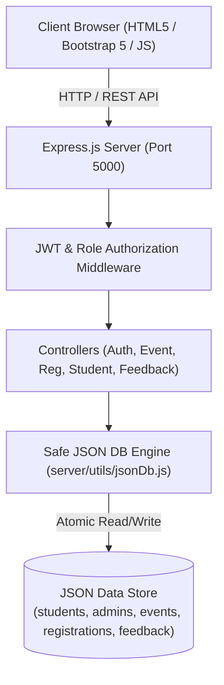

# 🎓 CampusConnect – Smart College Event Management and Student Engagement System

[](https://nodejs.org/)
[](https://expressjs.com/)
[](https://getbootstrap.com/)
[](#json-database-architecture)
[](LICENSE)

> **Final Year Engineering TAE-I Capstone Project**  
> A full-stack web application that unifies student event discovery, 1-click registration, automated digital pass ticketing, and administrative event lifecycle orchestration.

---

## 📌 Table of Contents
- [Project Overview](#-project-overview)
- [Key Features](#-key-features)
- [Technology Stack](#-technology-stack)
- [System Architecture](#-system-architecture)
- [Project Directory Structure](#-project-directory-structure)
- [Quick Start Guide](#-quick-start-guide)
- [Demo Credentials](#-demo-credentials)
- [REST API Reference](#-rest-api-reference)
- [JSON Database Architecture](#-json-database-architecture)
- [Automated Testing](#-automated-testing)
- [Render Cloud Deployment](#-render-cloud-deployment)
- [Git Version Control Instructions](#-git-version-control-instructions)
- [Documentation & Viva Prep](#-documentation--viva-prep)

---

## 🌟 Project Overview

In conventional collegiate settings, event announcements are fragmented across physical noticeboards, messaging apps, and ad-hoc Google Forms. This causes registration bottlenecks, missing ticket records, untracked seat capacities, and high manual overhead.

**CampusConnect** solves this by providing:
1. A public discovery portal with live search, categories, and department filters.
2. A dedicated **Student Portal** for 1-click event booking, digital event passes, cancellation, and rating reviews.
3. An advanced **Administrator Portal** for full CRUD event management, seat capacity limits, student directory, registration management, and Chart.js analytics.

---

## 🚀 Key Features

### 👨‍🎓 Student Capabilities
- **Authentication**: Secure account registration and login with bcrypt encryption & JWT session tokens.
- **Event Discovery**: Search by name, venue, organizer; filter by category, department, or date.
- **1-Click Registration**: Real-time capacity check, deadline check, duplicate registration prevention.
- **Digital Event Pass**: Unique ticket numbers (`TCK-EVTxxx-xxxx`) with print/download functionality.
- **Manage Bookings**: View upcoming registrations, participation history, and cancel tickets anytime.
- **Feedback & Rating**: Rate attended events from 1 to 5 stars with written reviews.

### 🛡️ Administrator Capabilities
- **Admin Dashboard**: Real-time counters (students, events, registrations, completions) and Chart.js visualizations.
- **Event Management**: Create, update, archive, and delete events with venue, dates, capacity, and rules.
- **Capacity Utilization**: Live tracking of booked seats vs. maximum seats with visual progress bars.
- **Registration Management**: Change student ticket statuses (`Registered`, `Attended`, `Cancelled`, `Waitlisted`).
- **Student Directory**: Search and manage registered students across engineering departments.
- **Review Moderation**: Monitor and manage student ratings and feedback.

---

## 💻 Technology Stack

| Layer | Technologies Used |
| :--- | :--- |
| **Frontend** | HTML5, CSS3, Bootstrap 5.3, Bootstrap Icons, Chart.js, Vanilla ES6+ JavaScript |
| **Backend** | Node.js, Express.js (REST API architecture) |
| **Database** | JSON File Database Engine (`fs.promises` with atomic writes) |
| **Security** | JSON Web Tokens (`jsonwebtoken`), Password Hashing (`bcryptjs`), CORS |
| **Testing** | Built-in Node.js HTTP Sanity & Integration Test Suite (`tests/api_test.js`) |
| **Deployment** | Render Cloud Web Service (`render.yaml`) |

---

## 📐 System Architecture



---

## 📂 Project Directory Structure

```text
CampusConnect/
├── data/                         # Primary JSON Database
│   ├── admins.json               # Admin credentials & profiles
│   ├── events.json               # College events catalog & capacity
│   ├── feedback.json             # Event ratings and reviews
│   ├── registrations.json        # Student event passes & statuses
│   └── students.json             # Student user records
│
├── public/                       # Responsive Frontend Web App
│   ├── css/
│   │   └── style.css             # Custom theme styling & variables
│   ├── js/
│   │   ├── admin.js              # Admin portal & chart controllers
│   │   ├── api.js                # Reusable fetch client with JWT
│   │   ├── auth.js               # Session state & route guards
│   │   ├── main.js               # Toast notifications & UI helpers
│   │   └── student.js            # Student portal & pass generator
│   ├── index.html                # Modern Homepage with Hero & Stats
│   ├── about.html                # Project details & Architecture
│   ├── events.html               # Public event discovery & filters
│   ├── event-details.html        # Detailed event page & reviews
│   ├── contact.html              # Helpdesk & support contact
│   ├── student-login.html        # Student login with demo autofill
│   ├── student-register.html     # Validated student registration
│   ├── admin-login.html          # Administrator login portal
│   ├── student-dashboard.html    # Student overview & quick pass
│   ├── student-profile.html      # Profile view & update form
│   ├── student-events.html       # Student in-portal event browse
│   ├── my-registrations.html     # Active passes & print tickets
│   ├── event-history.html        # Past events attended
│   ├── feedback.html             # Student feedback submission
│   ├── settings.html             # Password change & preferences
│   ├── admin-dashboard.html      # Admin overview & Chart.js graphs
│   ├── manage-events.html        # Admin event CRUD table
│   ├── add-event.html            # Dedicated Add Event form
│   ├── edit-event.html           # Dedicated Edit Event form
│   ├── manage-students.html      # Registered students table
│   ├── manage-registrations.html # Attendee pass management
│   ├── event-analytics.html      # Capacity analytics & charts
│   ├── manage-feedback.html      # Student review moderation
│   ├── 404.html                  # Custom Not Found error page
│   └── access-denied.html        # 403 Forbidden page
│
├── server/                       # Backend REST Application
│   ├── controllers/              # Business logic controllers
│   ├── middleware/               # Auth token & error middlewares
│   ├── routes/                   # Express REST endpoints
│   ├── utils/                    # JSON DB engine & validators
│   └── server.js                 # Main server entrypoint
│
├── tests/
│   └── api_test.js               # Automated integration test suite
├── .env                          # Local environment variables
├── .env.example                  # Template configuration
├── .gitignore                    # Git ignore file
├── DOCUMENTATION.md              # Complete 31-Chapter TAE-I Report
├── VIVA_QUESTIONS.md             # 30 Detailed Viva Q&A
├── package.json                  # Dependencies and start scripts
├── render.yaml                   # Render cloud configuration
└── README.md                     # Project documentation
```

---

## ⚡ Quick Start Guide

### Prerequisites
- [Node.js](https://nodejs.org/) (Version 18.0.0 or higher)
- [npm](https://www.npmjs.com/) (bundled with Node.js)
- Modern Web Browser (Chrome, Edge, Firefox, Safari)

### 1. Clone or Open Project
```bash
cd "c:/Users/ASUS/Desktop/College Event Management System"
```

### 2. Install Dependencies
```bash
npm install
```

### 3. Start the Server
```bash
npm start
```
*The application will boot at **http://localhost:5000**.*

---

## 🔑 Demo Credentials

| Role | Email | Password | Quick Action |
| :--- | :--- | :--- | :--- |
| **Super Admin** | `admin@campusconnect.edu` | `Admin@123` | Click **"Auto Fill"** on `/admin-login.html` |
| **Student** | `aarav.sharma@campusconnect.edu` | `Student@123` | Click **"Auto Fill"** on `/student-login.html` |
| **New Student** | *Any unique email* | *Your choice* | Use `/student-register.html` |

---

## 📡 REST API Reference

### Authentication
- `POST /api/auth/student/register` – Register new student account.
- `POST /api/auth/student/login` – Login student and return JWT.
- `POST /api/auth/admin/login` – Login administrator and return JWT.
- `GET /api/auth/me` – Verify active session and retrieve profile.
- `POST /api/auth/logout` – Clear user session.

### Events
- `GET /api/events` – Query events with search (`?search=`), category (`?category=`), status (`?status=`), and sort (`?sortBy=`).
- `GET /api/events/:id` – Get single event details with student reviews.
- `POST /api/events` – [Admin] Create a new event.
- `PUT /api/events/:id` – [Admin] Update event details.
- `DELETE /api/events/:id` – [Admin] Delete event and associated bookings.

### Registrations
- `GET /api/registrations` – [Admin] Get all registrations with filters.
- `GET /api/registrations/student/:studentId` – Get registrations for a student.
- `POST /api/registrations` – Register student for event (with capacity check).
- `PUT /api/registrations/:id` – Cancel or update status (`Registered`, `Attended`, `Cancelled`, `Waitlisted`).
- `DELETE /api/registrations/:id` – [Admin] Remove registration record.

### Students & Feedback
- `GET /api/students` – [Admin] Retrieve all enrolled students.
- `GET /api/students/:id` – Get single student profile.
- `PUT /api/students/:id` – Update profile or change password.
- `DELETE /api/students/:id` – [Admin] Delete student account.
- `GET /api/feedback` – Query event feedback.
- `POST /api/feedback` – Submit star rating and review.
- `DELETE /api/feedback/:id` – Remove feedback.

### Dashboards
- `GET /api/dashboard/student/:id` – Metrics, upcoming passes, recent activity.
- `GET /api/dashboard/admin` – Global metrics, category counts, status breakdown, popular events.

---

## 🗄️ JSON Database Architecture

The system uses safe asynchronous file operations via `server/utils/jsonDb.js`. It writes updates atomically to a `.tmp` file before renaming it, preventing file corruption:

- `readData(fileName)` – Safely reads and parses JSON files.
- `writeData(fileName, data)` – Atomically writes serialized data with indentation.
- `findById(fileName, id)` – Direct key lookup.
- `findByEmail(fileName, email)` – Case-insensitive email indexing.
- `createRecord(fileName, record)` – Generates unique IDs (`EVTxxx`, `REGxxx`, `STUxxx`, `FDBxxx`) with timestamps.
- `updateRecord(fileName, id, fields)` – Implements in-place updates while maintaining ID immutability.
- `deleteRecord(fileName, id)` – Removes records and saves updated state.

---

## 🧪 Automated Testing

Execute the built-in sanity test suite:
```bash
npm test
```
**Tests verified:**
1. Health check endpoint (`GET /api/health`)
2. Student login & JWT issuance
3. Admin login & JWT issuance
4. Event catalog query with category filters
5. Event creation by admin
6. 1-Click event registration by student
7. Duplicate registration prevention (HTTP 409 Conflict)
8. Student star rating and feedback submission
9. Admin dashboard metrics and category breakdown
10. Student dashboard counter verification

---

## ☁️ Render Cloud Deployment

The repository includes a ready-to-deploy [`render.yaml`](render.yaml) configuration:

1. Push your repository to **GitHub**.
2. Log into [Render Dashboard](https://dashboard.render.com/).
3. Click **New +** -> **Web Service** -> Connect your GitHub repository.
4. Set the following build settings:
   - **Environment**: `Node`
   - **Build Command**: `npm install`
   - **Start Command**: `npm start`
5. Configure Environment Variables:
   - `NODE_ENV`: `production`
   - `JWT_SECRET`: `your_random_secret_key`
   - `PORT`: `10000` (Render will assign `process.env.PORT`)
6. Click **Deploy Web Service**.

---

## 🛠️ Git Version Control Instructions

```bash
# 1. Initialize git repository
git init

# 2. Stage all files
git add .

# 3. Create initial commit
git commit -m "CampusConnect: Full-stack TAE-I College Event Management System"

# 4. Set main branch
git branch -M main

# 5. Add remote GitHub origin
git remote add origin https://github.com/YOUR_USERNAME/CampusConnect.git

# 6. Push to GitHub
git push -u origin main
```

---

## 📚 Documentation & Viva Prep
- 📖 **[DOCUMENTATION.md](DOCUMENTATION.md)** – Complete 31-Chapter Project Report (Problem Statement, Architecture, Test Cases, Deployment).
- 🎙️ **[VIVA_QUESTIONS.md](VIVA_QUESTIONS.md)** – 30 Comprehensive Viva Questions and Answers for Final Year Evaluation.

---

*Developed for Final Year Engineering TAE-I Evaluation.*
# S-B-JAIN-College-Event-Management-System-

